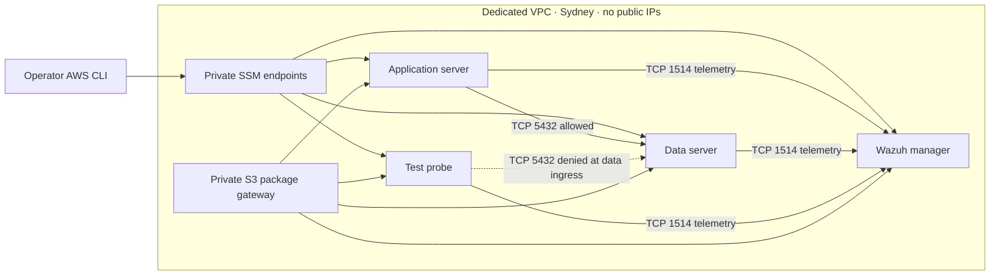
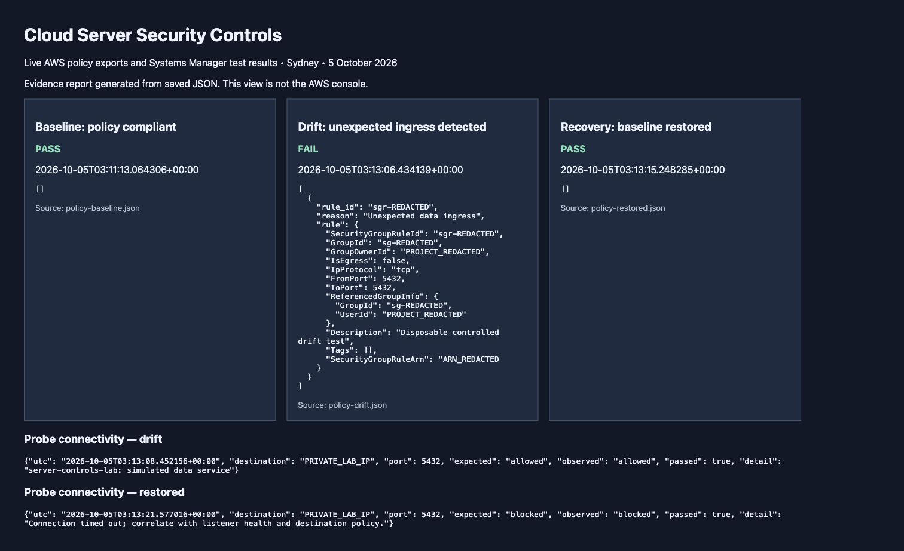
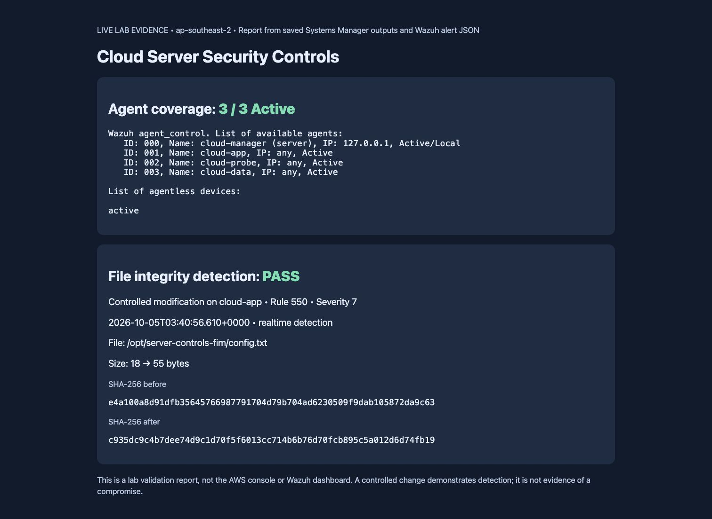
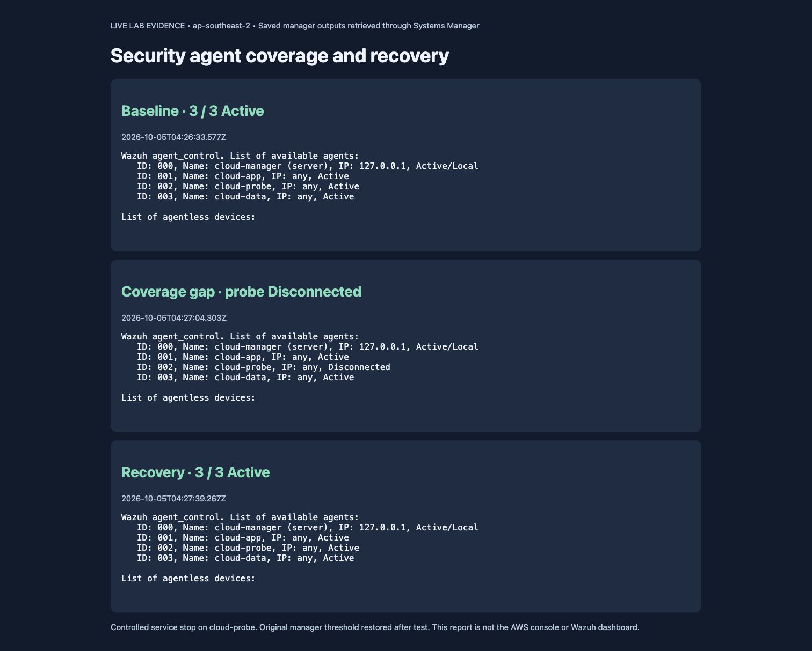

# Cloud Server Security Controls

**Private AWS server segmentation, Wazuh file integrity monitoring, and security control recovery with Terraform and Python.**

A hands-on lab showing how to deploy server controls, verify coverage, detect an unauthorized network rule, and restore healthy monitoring. Built in **ap-southeast-2 (Sydney)** on Amazon Linux 2023 with Wazuh 4.14.8. **Completed and cleaned up on 5 October 2026; evidence retained.**

## Results at a glance

| Test | Observed result | Evidence |
|---|---|---|
| Authorized application access | TCP 5432 returned the simulated service banner | [Baseline](evidence/segmentation-baseline.json) |
| Unapproved probe access | Connection timed out at the baseline | [Baseline](evidence/segmentation-baseline.json) |
| Controlled policy drift | Python audit changed PASS → FAIL; probe gained access | [Drift report](evidence/policy-drift.json) |
| Policy recovery | Audit returned PASS; probe access blocked again | [Restored policy](evidence/policy-restored.json) |
| Security agent coverage | Three cloud agents Active | [Health](evidence/wazuh-health.json) |
| File integrity detection | Real-time rule 550, level 7, recorded changed SHA-256 | [Actual alert](evidence/fim-alert.json) |
| Agent failure and recovery | 3 Active → probe Disconnected → 3 Active | [Recovery](evidence/recovery-restored.json) |
| Resource cleanup | See timestamped verification | [Cleanup](docs/cleanup.md) |

## Architecture

Four private subnets separate workload roles. Security-group references enforce the tested application-to-data policy. Systems Manager provides administration without inbound SSH. Packages are delivered through a restricted S3 gateway endpoint using short-lived signed URLs. Enrollment used password authentication and manager-certificate verification; TCP 1515 was closed after enrollment.

## Evidence

These report screenshots present saved live outputs. They are labelled reports, not AWS console or Wazuh dashboard screenshots. The [evidence index](evidence/README.md) explains provenance; an original AWS console capture is retained locally.

## Implementation and runbooks

- [Deployment and verification](docs/deployment-runbook.md)
- [Architecture decisions](docs/architecture-decisions.md)
- [Agent recovery procedure](docs/agent-recovery-runbook.md)
- [FIM investigation and troubleshooting](docs/operations-runbook.md)
- [Cost assumptions](docs/cost-estimate.md)
- [Cleanup and verification](docs/cleanup.md)
- [Terraform](terraform/main.tf) and [policy audit](scripts/audit-data-policy.py)

## Scope and limits

The data service is a Python TCP listener, not PostgreSQL or a payment application. Segmentation is enforced by AWS security groups; it is not a complete zero-trust implementation. The policy audit checks data-tier ingress only. This manager-only deployment has no indexer, dashboard, SOAR, ticketing, malware analysis, deception platform, or container coverage. The controlled file modification is a test, not a compromise. Framework identifiers in the Wazuh alert do not establish compliance.

One Availability Zone and small instances reduce lab cost but provide no high availability. Short-lived enrollment certificates and manually delivered packages are lab choices, not production lifecycle management. Infrastructure is reproducible with Terraform; Wazuh bootstrap is described as operator steps rather than falsely presented as a one-command deployment.

## Related projects

- [Wazuh FIM and AI-assisted triage](https://github.com/thmzhanbu/wazuh-fim-ai-triage): host alerts and investigation.
- [Security Operations Endpoint Automation](https://github.com/thmzhanbu/security-operations-endpoint-automation): agent deployment, maintenance, and coverage reporting.

These projects share a learning progression. The cloud manager was separate from the VMware environment; no hybrid connection is claimed.

## Learning and contribution

AI assistance supported implementation, troubleshooting, and documentation. Live AWS execution results and Wazuh alerts were verified separately. The repository is intended as a technical portfolio and lab reference, not a production security product.
